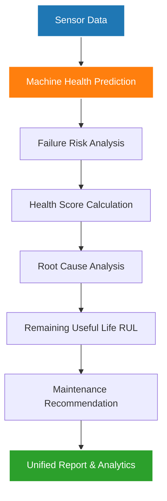

# 🧠 TexTwin AI SDK

> The Machine Learning SDK for the TexTwin Smart Machine Health Monitoring System.

[](https://www.python.org/)
[](https://scikit-learn.org/)
[](https://pandas.pydata.org/)
[](https://numpy.org/)
[](https://opensource.org/licenses/MIT)

---

## 📋 Project Overview

**TexTwin AI SDK** is the Machine Learning module of the **TexTwin Smart Machine Health Monitoring System**. It leverages a trained Random Forest model to predict real-time machine health state based on physical sensor telemetry. 

The SDK extends raw health prediction into advanced, actionable AI analytics, including multi-criteria failure risk assessment, health score calculation, diagnostic root cause analysis, remaining useful life (RUL) estimation, and priority-guided maintenance recommendations. It is designed to run asynchronously, process batch runs, and generate comprehensive diagnostics reports for industrial plant operations.

---

## ✨ Features

The SDK is composed of the following core modules:

*   **✅ Machine Health Prediction (Random Forest)**: Classified into operational states (`Running`, `Maintenance`, `Critical`, `Stopped`) with exact probability confidence.
*   **✅ Failure Risk Analysis**: Estimates the probability of imminent failure ($0\% - 100\%$) and classifies it into risk levels (`Low`, `Moderate`, `High`, `Critical`).
*   **✅ Health Score Calculation**: A normalized health rating ($0 - 100$) reflecting current operational status, adjusted for sensor anomalies and historical usage.
*   **✅ Root Cause Analysis**: Identifies exact parameter anomalies (e.g., extreme temperatures, high vibration, electrical overload) causing health degradation.
*   **✅ Remaining Useful Life (RUL)**: Estimates remaining service hours and days before failure, adjusting for current stress levels and cumulative run time.
*   **✅ Smart Maintenance Recommendation**: Generates specific actions (e.g., "Inspect cooling system immediately"), priority levels, and maintenance types (`Emergency`, `Corrective`, `Preventive`).
*   **✅ Unified AI Report Generator**: Aggregates predictions and analytics from all sub-engines into a single, cohesive, ready-to-consume report.
*   **✅ Batch Prediction Engine**: Performs bulk prediction on tabular datasets, joining telemetry rows with complete AI analytics.
*   **✅ Factory Analytics**: Aggregates fleet-wide metrics including average health scores, global failure risk, and operational status summaries.
*   **✅ Machine Ranking**: Ranks fleet units to highlight top healthy machines and identify critical units needing immediate attention.

---

## 🛠️ Technologies Used

The SDK is built on a light, robust Python scientific stack optimized for high-throughput inference:

| Technology | Logo/Badge | Purpose |
| :--- | :--- | :--- |
| **Python** | `Python 3.10+` | Core programming language & runtime execution |
| **Scikit-learn** | `Scikit-learn` | Core classifier training, model validation, and serialized prediction |
| **Pandas** | `Pandas` | High-performance data structures and batch manipulation |
| **NumPy** | `NumPy` | Multi-dimensional array operations and signal transformations |
| **Joblib** | `Joblib` | Light serialization and deserialization of the trained Random Forest models |

---

## ⚙️ AI Pipeline

The following chart outlines the sequential data processing pipeline of the SDK. Raw sensor telemetry flows through the core predictor, sequentially feeding child evaluation engines until a unified report is compiled:



---

## 📂 Folder Structure

The Machine Learning workspace maintains a modular structure:

```
ml/
├── dataset/                  # Contains telemetry records (raw, processed, synthetic)
├── models/                   # Serialized Random Forest binaries and encoder objects
├── scripts/                  # Command-line pipelines (EDA, Preprocessing, Training, Grid Search)
├── tests/                    # Integration and unit tests
├── textwin_ai/               # Core Python SDK
│   ├── analytics/            # Fleet aggregation and ranking utilities
│   └── ...
├── reports/                  # Generated performance and evaluation reports
├── requirements.txt          # Python library dependencies
└── README.md                 # This workspace documentation
```

---

## 🚀 Installation & Setup

1. **Clone the repository and enter the ML workspace:**
   ```bash
   git clone <repository-url>
   cd ml
   ```

2. **Configure a virtual environment (Recommended):**
   ```bash
   python -m venv venv
   # On Windows:
   venv\Scripts\activate
   # On macOS/Linux:
   source venv/bin/activate
   ```

3. **Install dependencies:**
   ```bash
   pip install -r requirements.txt
   ```

---

## 📋 System Requirements

*   **Runtime Environment**: Python `3.10+`
*   **Operating System**: Windows / Linux / macOS
*   **Key Libraries**:
    *   `numpy>=1.22.0`
    *   `pandas>=1.4.0`
    *   `scikit-learn>=1.0.0`
    *   `joblib`

---

## 📥 Input Schema

The predictor requires a flat telemetry dictionary containing the following numerical features:

| Parameter | Type | Unit | Description |
| :--- | :--- | :--- | :--- |
| `Temperature` | `float` | °C | Current core operating temperature |
| `Vibration` | `float` | mm/s | Root Mean Square (RMS) vibration velocity |
| `RPM` | `int` | rpm | Rotational speed of the main shaft |
| `Humidity` | `float` | % | Ambient relative humidity |
| `Power` | `float` | kW | Power consumption |
| `Running_Hours` | `float` | hours | Cumulative hours the machine has been in service |

### Input JSON Example
```json
{
  "Temperature": 85.5,
  "Vibration": 6.8,
  "RPM": 2200,
  "Humidity": 78.2,
  "Power": 7.4,
  "Running_Hours": 6500.0
}
```

---

## 📤 Output Schema

The output is a dictionary containing prediction class, confidence, health scores, and descriptive maintenance suggestions.

### Output JSON Example
```json
{
  "status": "Maintenance",
  "confidence": 88.5,
  "failureRisk": 53.0,
  "riskLevel": "High",
  "healthScore": 39.0,
  "healthLevel": "Poor",
  "rootCause": "High operating temperature, High vibration, Machine aging",
  "remainingDays": 136.69,
  "recommendation": [
    "Check machine cooling efficiency.",
    "Inspect bearing lubrication.",
    "Plan routine maintenance."
  ],
  "priority": "High",
  "maintenanceType": "Preventive"
}
```

---

## 💻 Code Usage Example

To perform real-time pipeline inference in python, import the unified `TexTwinAI` class:

```python
from textwin_ai.report_generator import TexTwinAI

# 1. Initialize the unified AI orchestrator
ai = TexTwinAI()

# 2. Feed current telemetry
report = ai.predict(
    temperature=35.0,
    vibration=1.5,
    rpm=1200,
    humidity=60.0,
    power=4.5,
    running_hours=120.0
)

# 3. View diagnostics
print(f"Status: {report['status']} (Confidence: {report['confidence']}%)")
print(f"Health Score: {report['healthScore']} | Risk: {report['failureRisk']}%")
print(f"Action Recommended: {report['recommendation']}")
```

---

## 🧪 Running Tests

To verify that the ML modules and analytics engines operate correctly, execute the following commands in the workspace root directory:

```bash
# Core Predictor test
python -m tests.test_predictor

# Failure Risk Analysis test
python -m tests.test_failure_risk

# Health Score calculation test
python -m tests.test_health_score

# Root Cause analysis test
python -m tests.test_root_cause

# Remaining Useful Life (RUL) test
python -m tests.test_rul

# Recommendation Engine test
python -m tests.test_recommendation

# Combined Report Generator test
python -m tests.test_report_generator

# Fleet-wide Factory Analytics test
python -m tests.test_factory_analytics

# Machine Ranking Analytics test
python -m tests.test_machine_ranking
```

---

## 👥 Contributors

This section will list the key developers and maintainers of the Machine Learning module.

*   *Your Name / Organization (Placeholder)* - Lead ML Engineer

---
