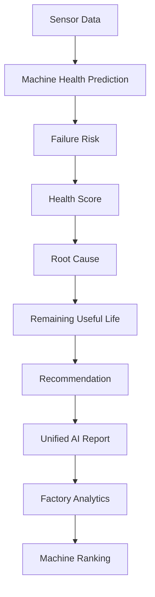

# 🧠 TexTwin AI SDK


> **Machine Learning SDK for the TexTwin Smart Machine Health Monitoring System**

---

# 📖 Table of Contents

- Project Overview
- Key Features
- Project Architecture
- AI Pipeline
- Folder Structure
- Installation
- Requirements
- Input Schema
- Output Schema
- Usage Example
- Batch Prediction
- Factory Analytics
- Machine Ranking
- Running Tests
- Model Performance
- Project Statistics
- Future Enhancements
- Contributors
- License

---

# 📋 Project Overview

TexTwin AI SDK is the Machine Learning module powering the **TexTwin Smart Machine Health Monitoring System**.

The SDK predicts machine operating conditions using industrial sensor telemetry and extends the prediction with intelligent analytics for predictive maintenance.

Instead of simply predicting whether a machine is healthy or unhealthy, TexTwin AI provides a complete maintenance intelligence report including:

- Machine Health Prediction
- Failure Risk Analysis
- Health Score
- Root Cause Analysis
- Remaining Useful Life (RUL)
- Maintenance Recommendation
- Factory Analytics
- Machine Ranking
- Unified AI Report Generation

The SDK is modular, lightweight, and designed for seamless integration with backend APIs and industrial dashboards.

---

# ✨ Key Features

## 🤖 Machine Health Prediction

Predicts the operational status of industrial machines using a trained Random Forest classifier.

Supported classes:

- Running
- Maintenance
- Critical
- Stopped

Returns prediction confidence for every prediction.

---

## ⚠ Failure Risk Analysis

Computes machine failure probability.

Output includes

- Failure Risk (%)
- Risk Level

Risk Levels

- Low
- Moderate
- High
- Critical

---

## ❤️ Health Score Engine

Calculates an overall machine health score from 0–100.

Health Levels

- Excellent
- Good
- Fair
- Poor
- Critical

---

## 🔍 Root Cause Analysis

Identifies abnormal operating parameters responsible for degraded machine performance.

Examples

- High Temperature
- Excessive Vibration
- High Power Consumption
- High Humidity
- High RPM
- Machine Aging

---

## ⏳ Remaining Useful Life (RUL)

Predicts

- Remaining Operating Hours
- Remaining Operating Days
- Remaining Life Level

Life Levels

- Excellent
- Good
- Moderate
- Low

---

## 🔧 Smart Maintenance Recommendation

Automatically recommends maintenance actions.

Examples

- Inspect cooling system
- Replace bearing
- Check shaft alignment
- Inspect electrical load
- Schedule preventive maintenance

Returns

- Recommendation List
- Priority
- Maintenance Type

---

## 📄 Unified AI Report Generator

Combines every AI engine into a single prediction report.

The report includes

- Machine Status
- Confidence
- Failure Risk
- Health Score
- Root Cause
- Remaining Useful Life
- Maintenance Recommendation

---

## 📊 Batch Prediction Engine

Predicts thousands of machines simultaneously using CSV datasets.

Useful for

- Factory Monitoring
- Industrial Analytics
- Fleet Analysis

---

## 🏭 Factory Analytics

Generates factory-wide statistics.

Includes

- Total Machines
- Running Machines
- Machines Under Maintenance
- Critical Machines
- Stopped Machines
- Average Health Score
- Average Failure Risk
- Average Prediction Confidence

---

## 🏆 Machine Ranking

Ranks machines based on Health Score.

Provides

- Top Healthy Machines
- Top Critical Machines

Useful for maintenance planning.

---

# 🏗 Project Architecture

```

Sensor Data

↓

Machine Health Prediction

↓

Failure Risk Analysis

↓

Health Score Calculation

↓

Root Cause Analysis

↓

Remaining Useful Life

↓

Maintenance Recommendation

↓

Unified AI Report

↓

Factory Analytics

↓

Machine Ranking

```

---

# ⚙ AI Pipeline



---

# 📂 Project Structure

```
ml/

├── batch/

├── configs/

├── dataset/

│ ├── raw/

│ ├── processed/

│ └── synthetic/

├── models/

│ └── trained/

├── notebooks/

├── reports/

├── scripts/

├── tests/

├── textwin_ai/

│ ├── analytics/

│ ├── predictor.py

│ ├── failure_risk.py

│ ├── health_score.py

│ ├── root_cause.py

│ ├── rul.py

│ ├── recommendation.py

│ ├── report_generator.py

│ └── ...

├── README.md

├── API_GUIDE.md

├── CHANGELOG.md

├── CONTRIBUTING.md

├── LICENSE

├── VERSION

├── requirements.txt

└── .gitignore
```

---

# 🚀 Installation

Clone the repository

```bash
git clone <repository-url>
```

Enter ML folder

```bash
cd ml
```

Create virtual environment

```bash
python -m venv .venv
```

Windows

```bash
.venv\Scripts\activate
```

Linux / macOS

```bash
source .venv/bin/activate
```

Install dependencies

```bash
pip install -r requirements.txt
```

---

# 💻 Requirements

- Python 3.10+
- NumPy
- Pandas
- Scikit-learn
- Joblib
- Matplotlib
- Seaborn

---
# 📥 Input Schema

TexTwin AI requires six machine sensor parameters.

| Parameter | Type | Unit | Description |
|-----------|------|------|-------------|
| Temperature | Float | °C | Machine operating temperature |
| Vibration | Float | mm/s | Machine vibration level |
| RPM | Integer | rpm | Shaft rotational speed |
| Humidity | Float | % | Ambient humidity |
| Power | Float | kW | Machine power consumption |
| Running_Hours | Float | Hours | Total machine running hours |

---

## Example Input

```json
{
    "Temperature": 35,
    "Vibration": 1.5,
    "RPM": 1500,
    "Humidity": 60,
    "Power": 4.5,
    "Running_Hours": 250
}
```

---

# 📤 Output Schema

The AI returns a complete maintenance intelligence report.

## Example Output

```json
{
    "status": "Running",
    "confidence": 100.0,
    "failureRisk": 5,
    "riskLevel": "Low",
    "healthScore": 95,
    "healthLevel": "Excellent",
    "rootCause": "No abnormal operating condition detected.",
    "remainingHours": 17941.7,
    "remainingDays": 747.57,
    "lifeLevel": "Excellent",
    "recommendation": [
        "Machine operating normally. Continue monitoring."
    ],
    "priority": "Low",
    "maintenanceType": "Preventive"
}
```

---

# 🚀 Quick Start

## Import SDK

```python
from textwin_ai.report_generator import TexTwinAI
```

---

## Initialize AI Engine

```python
ai = TexTwinAI()
```

---

## Predict Machine Health

```python
sensor_data = {
    "Temperature": 35,
    "Vibration": 1.5,
    "RPM": 1500,
    "Humidity": 60,
    "Power": 4.5,
    "Running_Hours": 250
}

result = ai.predict(sensor_data)

print(result)
```

---

# 📄 Sample Prediction Report

```python
{
    "status": "Running",
    "confidence": 100.0,
    "failureRisk": 5,
    "healthScore": 95,
    "rootCause": "No abnormal operating condition detected.",
    "remainingDays": 747.57,
    "recommendation": [
        "Machine operating normally. Continue monitoring."
    ]
}
```

---

# 📦 Batch Prediction

TexTwin AI supports prediction for multiple machines simultaneously.

```python
from batch.batch_predict import BatchPredictor

batch = BatchPredictor()

batch.predict_csv(
    input_file="dataset/synthetic/textwin_sensor_dataset.csv",
    output_file="reports/prediction_results.csv"
)
```

Generated report:

```
reports/
    prediction_results.csv
```

---

# 🏭 Factory Analytics

Analyze an entire production plant.

```python
from textwin_ai.analytics.factory_analytics import FactoryAnalytics

analytics = FactoryAnalytics()

report = analytics.generate(factory_dataframe)

print(report)
```

Example Output

```python
{
    "totalMachines": 5000,
    "running": 2000,
    "maintenance": 1500,
    "critical": 1000,
    "stopped": 500,
    "averageHealthScore": 56.0,
    "averageFailureRisk": 43.0,
    "averageConfidence": 99.98
}
```

---

# 🏆 Machine Ranking

Rank factory machines based on health.

```python
from textwin_ai.analytics.machine_ranking import MachineRanking

ranking = MachineRanking()

healthy = ranking.top_healthy(df,5)

critical = ranking.top_critical(df,5)
```

Example

Top Healthy Machines

| Status | Health Score | Failure Risk |
|---------|-------------:|-------------:|
| Running | 95 | 5 |
| Running | 95 | 5 |
| Running | 95 | 5 |

Top Critical Machines

| Status | Health Score | Failure Risk |
|---------|-------------:|-------------:|
| Stopped | 0 | 100 |
| Stopped | 0 | 100 |
| Stopped | 0 | 100 |

---

# 🧪 Running Tests

Run every module individually.

```bash
python -m tests.test_predictor

python -m tests.test_failure_risk

python -m tests.test_health_score

python -m tests.test_root_cause

python -m tests.test_rul

python -m tests.test_recommendation

python -m tests.test_report_generator

python -m tests.test_factory_analytics

python -m tests.test_machine_ranking
```

If all tests pass, the SDK is functioning correctly.

---

# 📊 Model Performance

| Property | Value |
|-----------|-------|
| Algorithm | Random Forest |
| Classification Type | Multi-Class |
| Number of Classes | 4 |
| Input Features | 6 |
| Output Features | 12+ AI Insights |
| Model Format | Joblib (.pkl) |
| Programming Language | Python |
| ML Framework | Scikit-learn |

---

# 📈 AI Modules Summary

| Module | Description |
|----------|-------------|
| Predictor | Machine State Prediction |
| Failure Risk | Risk Estimation |
| Health Score | Machine Health Index |
| Root Cause | Diagnostic Engine |
| RUL | Remaining Useful Life |
| Recommendation | Maintenance Planning |
| Report Generator | Unified AI Report |
| Batch Prediction | CSV Prediction Engine |
| Factory Analytics | Factory Dashboard Metrics |
| Machine Ranking | Best/Worst Machine Ranking |

---
# 📈 Project Statistics

| Metric | Value |
|----------|--------|
| Programming Language | Python 3.10+ |
| Machine Learning Algorithm | Random Forest |
| AI Modules | 10 |
| Analytics Modules | 2 |
| Input Features | 6 |
| Output Insights | 12+ |
| Supported Machine States | 4 |
| Unit Tests | 9 |
| Model Format | Joblib (.pkl) |
| Batch Prediction | Supported |
| Factory Analytics | Supported |
| Machine Ranking | Supported |

---

# 🚀 Future Enhancements

TexTwin AI SDK is designed with scalability in mind. Future versions may include:

- 🌐 Real-time IoT sensor integration
- ☁ Cloud deployment using Docker and Kubernetes
- 📊 Live monitoring dashboard
- 🤖 Deep Learning models (LSTM / Transformer)
- 📈 Predictive maintenance scheduling
- 🔄 Automatic model retraining
- 📡 MQTT & OPC-UA industrial protocol support
- 📱 Mobile application integration
- 🔔 Real-time alert and notification system
- 🌍 Multi-factory analytics dashboard
- 🧠 Explainable AI (XAI) for prediction transparency

---

# 🎯 Applications

TexTwin AI SDK can be used in various industrial environments:

- Manufacturing Plants
- CNC Machines
- Smart Factories
- Automotive Industries
- Oil & Gas Equipment
- Wind Turbines
- Industrial Motors
- HVAC Systems
- Water Treatment Plants
- Predictive Maintenance Platforms

---

# 🔒 License

This project is licensed under the **MIT License**.

See the **LICENSE** file for complete details.

---

# 🤝 Contributing

Contributions are welcome.

If you'd like to improve TexTwin AI SDK:

1. Fork the repository.
2. Create a feature branch.
3. Commit your changes.
4. Push the branch.
5. Open a Pull Request.

Please ensure all tests pass before submitting any contribution.

---

# 👨‍💻 Contributors

| Name | Role |
|------|------|
| **Dinesh S** | Machine Learning Developer |
| **TexTwin Team** | Project Development & Integration |

---

# 🙏 Acknowledgements

Special thanks to:

- SNS College of Technology
- TexTwin Project Team
- Open Source Python Community
- Scikit-learn Contributors
- NumPy & Pandas Developers

for providing the tools and ecosystem that made this project possible.

---

# 📚 Documentation

Additional documentation is available in:

- `API_GUIDE.md`
- `CHANGELOG.md`
- `CONTRIBUTING.md`

---

# ⭐ Version

Current Release

```
TexTwin AI SDK v1.0.0
```

---

# 📬 Support

For questions, feature requests, or bug reports, please contact the TexTwin development team or open an issue in the project repository.

---

# 🏁 Final Notes

TexTwin AI SDK provides an end-to-end predictive maintenance solution for industrial machines. By combining machine learning with intelligent analytics, the SDK transforms raw sensor data into actionable insights that help reduce downtime, improve maintenance planning, and enhance operational efficiency.

---

<div align="center">

## ⭐ TexTwin AI SDK ⭐

**Smart Machines. Intelligent Maintenance. Reliable Predictions.**

**Version 1.0.0**

Made with ❤️ using Python & Scikit-learn

</div>